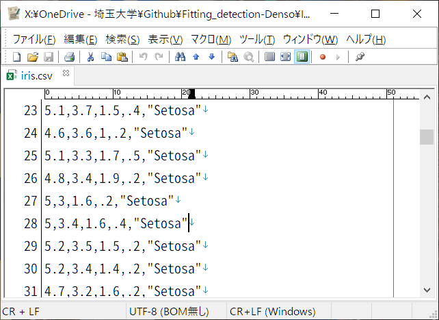

# Pythonを使ったファイルの読み書き

次にファイルの読み書きについて学びます．

--- 
### 読み書きの基本

データ分析の際には，データファイルからデータを読み出してプログラムで処理し，処理結果をデータファイルに保存します．ここでは，ファイルの読み書きについて学びます．

データの性質によってファイル保存形式が異なります．
下に代表的なデータと保存形式をまとめます．

| データの種類  | 主な保存形式 | 拡張子 |
| ------------- | ------------- | -------------  |
| テキスト・数値  | テキスト / `CSV形式` / TSV形式 / Wordファイル/ Excelファイル  | .txt / `.csv` / .tsv / .doc, .docx / .xlsx |
| 画像 | ビットマップ形式 / png形式 / jpeg形式 / gif形式  | .bmp / .png / .jpg, .jpeg / .gif |
| 映像  | avi形式 / mpeg4形式 / mov形式 / wmv形式  | .avi / .mp4 / .mov / .wmv |
| 音声  | wave形式 / mpeg形式 / aac形式  | .wav / .mp3 / .mp4, .aac |

今回は CSVファイルの読み書きを行います．他の形式のファイルの読み書きについては自身で調べてみましょう．

---
### csvファイルとは？

次のファイルをメモ帳等のテキストエディタで眺めてみましょう．



>> 

---
### csvファイルの読み込み

読み込みの際には，次のコードのどちらかをコピー&ペーストして使いましょう．
- ヘッダーがある場合

```Python
# ヘッダーあり
import pandas as pd
import numpy as np
 
input_file = 'input.csv'	# 読み込むファイル名
input_data = pd.read_csv(input_file)
input_data = np.array(input_data)
```
- ヘッダーがない場合

```Python
# ヘッダーなし
import pandas as pd
import numpy as np
　
input_file = 'input.csv'	# 読み込むファイル名
input_data = pd.read_csv(input_file, header=None)
input_data = np.array(input_data)
```
変数 `input_file` に読み込みたいファイルの名前を入れましょう．  
読み込んだデータは `input_data` に入ります．

---
### csvファイルの書き込み

書き込みの際には，以下のコードを使いましょう．
```Python
output_file = 'output.csv'		# 書き込むファイル名
df = pd.DataFrame(data)
df.to_csv(output_file, header=False, index=False)
```

変数 `output_file_name` には書き込むファイルの名前が入ります．  
書き込むデータは `data` に入っているとします．

---
### 練習課題：

コード []()

[>> `iris.csv`](iris.csv)


---
### 演習課題：


--- 
次： [Pythonを使ったファイルの読み書き]()
