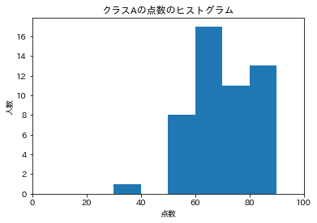
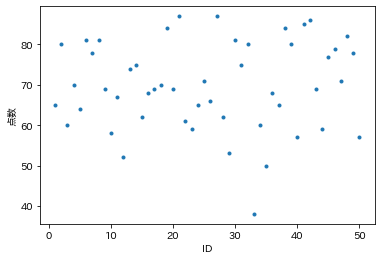
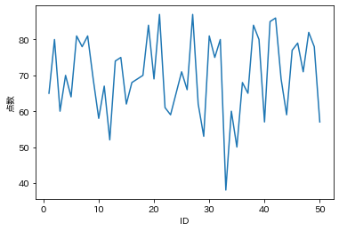
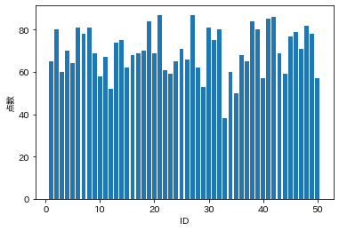

# 確率とグラフのプロット

自在にデータを扱いたいのであれば，確率と統計の知識は身につける必要があります．
ここでは，データ分析を行うための最低限の数学的な知識を扱っていきます．
この知識を身につければ，基礎的なデータ分析手法は理解できるようになるでしょう．

一方で，ここで得られる武器は初期装備，つまりヒノキの棒に過ぎないのも事実です．
より柔軟にデータ分析したいのであれば，確率・統計の専門書などを参考にさらに勉強してみてください．

--- 
### モジュールの説明

まずはPythonで確率・統計を扱うためのモジュールを紹介します．
はじめに，Colaboratory のコードセルに以下のコードを入力して実行してください．
グラフをプロットする際に日本語を扱うためのモジュールをインストールします．

```
!pip install japanize-matplotlib
```

次に，以下のコードでモジュールを読み込んでください．


```Python
"""
モジュールのインポート
"""
import numpy as np  # Numpyモジュール
import pandas as pd # Pandasモジュール
import scipy as sp  # 数値計算用モジュール
import matplotlib.pyplot as plt   # プロット用モジュール
import japanize_matplotlib # 日本語表示用モジュール
```
各モジュールを簡単に説明します．

- `numpy`： 配列を扱うためのモジュール．
- `pandas`： CSVファイルの読み込み等で便利なモジュール．
- `scipy`： 高度な数値計算を行う関数が多数収められたモジュール．
- `matplotlib`： 図をプロットする関数が納められたモジュール．
- `japanize_matplotlib`： `matplotlib`で日本語を扱うためのモジュール．

---
### ヒストグラムから見るデータの特徴

ここからは実際のデータを使って確率の基礎を勉強しましょう．

データ [socre_A.csv](socre_A.csv) と[socre_B.csv](socre_B.csv) を見てください．
これはある学校で２つクラスに同じテストを行ったときの点数をまとめたものです．
０列目には「学籍番号」が，１列目には「テストの点」が並んでいます．
それでは先生になりきって，各クラスの点数に表れる特徴を考えてみましょう．

...といっても，データをただにらめっこしても何もわからず日が暮れてしまうでしょう．
それでは，テストの点数に関する **ヒストグラム** を見てみましょう．




ヒストグラムとは，データを数値の区分ごとに区分けして，そのデータの数(度数)を表現したものです．
今回は，10点ごとに区分を作っています．

グラフを見るとなるほど，Aクラスは点数のばらつきが小さく，全体的に優秀な生徒が多いですね．
一方で，Bクラスは点数のばらつきが大きく，100点を取る学生もいれば30点台の学生もいます．

ただヒストグラムだけでは各クラスの特徴がわかりにくいですね．
クラスA とクラスB で平均点，点数のばらつきはどれだけあるのでしょうか？

---
### 確率の基礎

データの特徴を数値化して捉えることは，あらゆる課題解決において特に重要です．
特徴を数値で説明することで，どこに課題があるのか？を明確にすることができますし，それを他人に説明するときに説得力が増します．

データの特徴としては，主に以下の４つがあります．それぞれ説明します．
- 平均  
- 分散と標準偏差
- 中央値
- 最頻値

#### 平均

平均は以下のコードで計算できます．
```Python
mu = np.mean(x)
```
あるいは
```Python
mu = sp.stats.mean(x)
```

#### 分散と標準偏差

分散・標準偏差は，データの数値の散らばり具合を表す指標です．
分散は各データごとに平均点からの差を計算して，その二乗した値の平均を指します．
また標準偏差は分散の平方根で計算することができます．

`x` の分散は以下のコードで計算できます．
```Python
variance = np.var(x)
```

リスト `x` の標準偏差は次のとおりです．
```Python
variance = np.std(x)
```
#### 中央値

中央値とは，データを数値の大きい(小さい)順に並べたときの，順位が中央である値のことです．
例えば，`[3, 2, 1, 4, 3, 0, 2, 0, 2]` というリストの中央値を考えます．
数値を大きい順に並べると `[4, 3, 3, 2, 2, 2, 1, 0, 0]` となるので，中央値は５番目の数値の「2」になります．

リスト `x` の中央値は以下のコードで計算できます．
```Python
med = np.median(x)
```

#### 最頻値

最頻値とは最もよく出現する数値のことです．
例えば，`[3, 2, 1, 4, 3, 0, 2, 0, 2]` といリストの最頻値を考えます．
各値の出現回数をカウントします．
- "4" : 1回
- "3" : 2回
- "2" : 3回
- "1" : 1回
- "0" : 2回

最も多く表れるのは "2"なので，最頻値は「2」になります．

リスト `x` の最頻値は以下のコードで計算します．
```Python
uniq, freq = np.unique(x, return_counts=True) # uniq : リストの値，freq : 各出現回数，が得られる
mode = unique[np.argmax(freq)] # freq から最も出現回数の大きい値を抜き出す．mode : 最頻値
```

---
### グラフのプロット

他人にデータの特徴を説明するとき，まずは平均や分散などを使うことを考えましょう．
これらは客観的な数値ですから，「なんとなくばらついている」という感覚的な説明よりは説得力が増しますよね．
ただ一方で，データを直感的に理解したい！というときに，数値を出すと聞いている人は頭が混乱するでしょう．
データを説明するときに大切なのは， **平均や分散などの「数学的な尺度」と直感的に特徴を把握できる「グラフ」を示せばよいでしょう** ．

グラフをプロットするコードは，グラフの種類によって変わってきます．
次にコードを簡単にまとめました．

#### データの読み込み

まずはプロットするデータを読み込みます．[score_A.csv]()をダウンロードして，読み込めるようにGooge Driveに配置してください．

```Python
"""
データの読みこみ
"""
input_file = 'score_A.csv'  # 読み込むファイル名
input_data = pd.read_csv(input_file)
input_data = np.array(input_data)

id = input_data[:,0] # 学籍番号
score = input_data[:,1] # テストの点数
```
データを読み込んだら，以下のいずれかのコードで図をプロットします．

#### 1. 点のプロット

各データを点でプロットします．
```Python
# 点のプロット
plt.plot(id,score,'.')
```
- 第１引数 `id`： 横軸の値を並べた配列 or リスト
- 第２引数 `score` ： 縦軸の値を並べた配列 or リスト



#### 2. 折れ線グラフのプロット

各データを点でプロットし，線でつなぎます．
日ごとの気温など，時系列データに対して使われることが多いです．
```Python
# 折れ線グラフ
plt.plot(id,score)
```
- 第１引数 `id`： 横軸の値を並べた配列 or リスト
- 第２引数 `score` ： 縦軸の値を並べた配列 or リスト



#### 3. 棒グラフのプロット

各データを棒グラフでプロットします．
果物の品目ごとの消費量など，各行のデータが独立な場合に使われることが多いです．
```Python
# 棒グラフ
plt.bar(id,score)
```
- 第１引数 `id`： 横軸の値を並べた配列 or リスト
- 第２引数 `score` ： 縦軸の値を並べた配列 or リスト



#### 4. ヒストグラムのプロット

```Python
# ヒストグラム
plt.hist(score, bins=[0,10,20,30,40,50,60,70,80,90,100])
```
- 第１引数 `score` ： ヒストグラムにしたい配列 or リスト
- 第２引数 `bins` ： 階級数(棒の数)


---
### 軸のラベルの付け方

作成したグラフを他人と共有するときは，ぜひ縦軸と横軸にラベルを付けましょう．
ラベルは，各軸がどういう意味をもつか？を示したものです．
図をプロットした直後に，以下のようなコードを書きましょう．
上から，x軸のラベルとy軸のラベルを決める関数です．
```Python
plt.xlabel('ID') # x軸のラベル
plt.ylabel('SCORE') # y軸のラベル
```

---
## 練習問題
### 練習問題１： グラフのプロット

コード [`08_plot.py`](08_plot.py) は [score_A.csv](https://raw.githubusercontent.com/YosukeSugiura/Introduction_to_Programming/main/08_prob_plot/score_A.csv) を読み込んで点でプロットするものです．
このコードを改良し，以下のグラフも表示させましょう．
- 折れ線グラフ (x軸のラベル：`'ID'`，y軸のラベル：`'点数'`)
- 棒グラフ (x軸のラベル：`'ID'`，y軸のラベル：`'点数'`)

### 練習問題２： ヒストグラムのプロット

コード [`08_plot.py`](08_plot.py) を改良し，ヒストグラムをプロットしましょう．
このとき，x軸のラベル：`'点数'`，y軸のラベル：`'人数'`と設定します．

階級数(`bins=`で設定するもの)を色々な値に変更してみて，表示されるグラフの形の違いを確認しましょう．

### 練習問題３： 平均・分散・標準偏差・中央値・最頻値

データ [score_A.csv](https://raw.githubusercontent.com/YosukeSugiura/Introduction_to_Programming/main/08_prob_plot/score_A.csv) と [score_B.csv](https://raw.githubusercontent.com/YosukeSugiura/Introduction_to_Programming/main/08_prob_plot/score_B.csv) の平均，分散，標準偏差，中央値，最頻値をそれぞれ計算してみましょう．
それぞれのクラスでの点数の特徴を説明してみましょう．

---
[< 前へ](../07_module) | [トップに戻る](https://github.com/YosukeSugiura/Introduction_to_Programming) | [次へ >](../09_statistics) 
